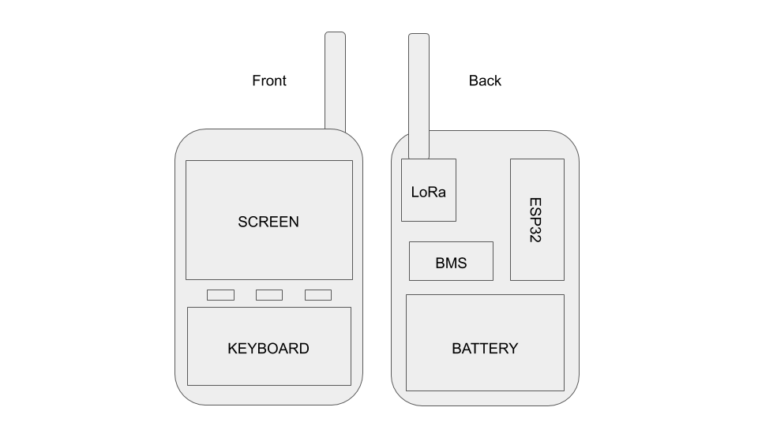
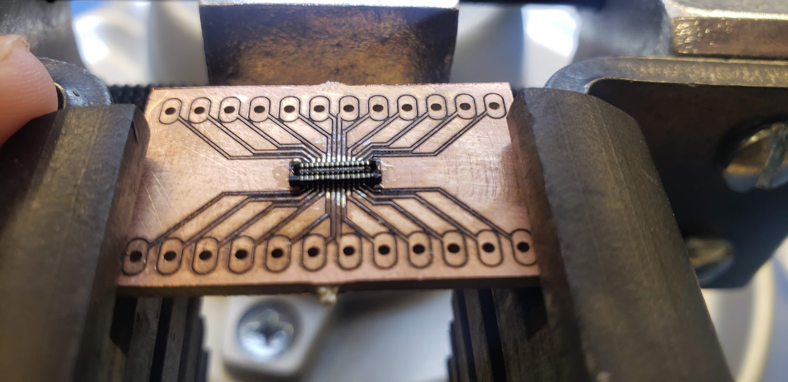
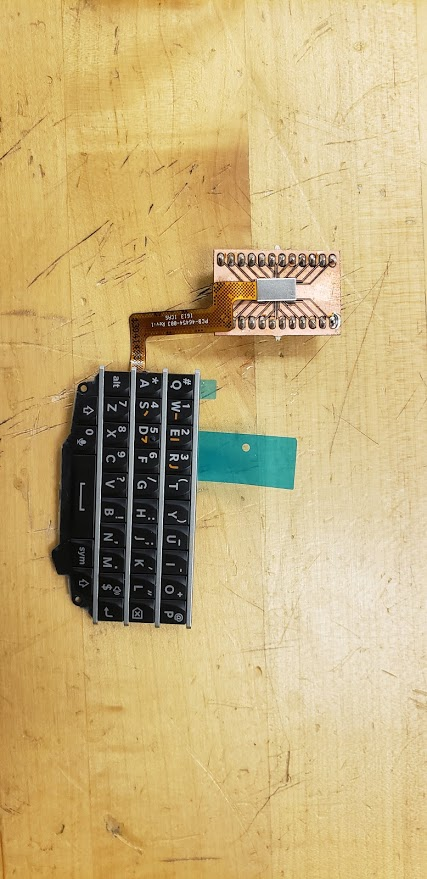
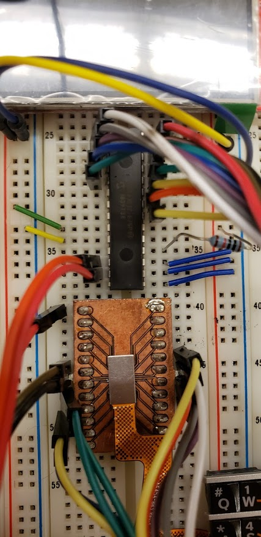
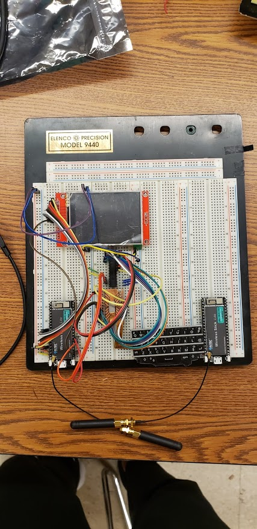
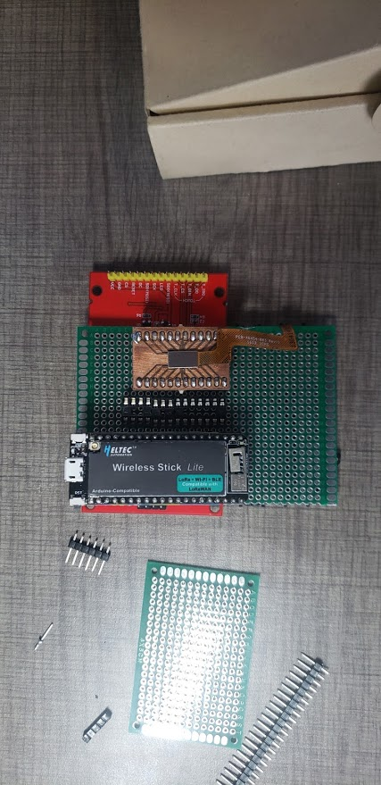
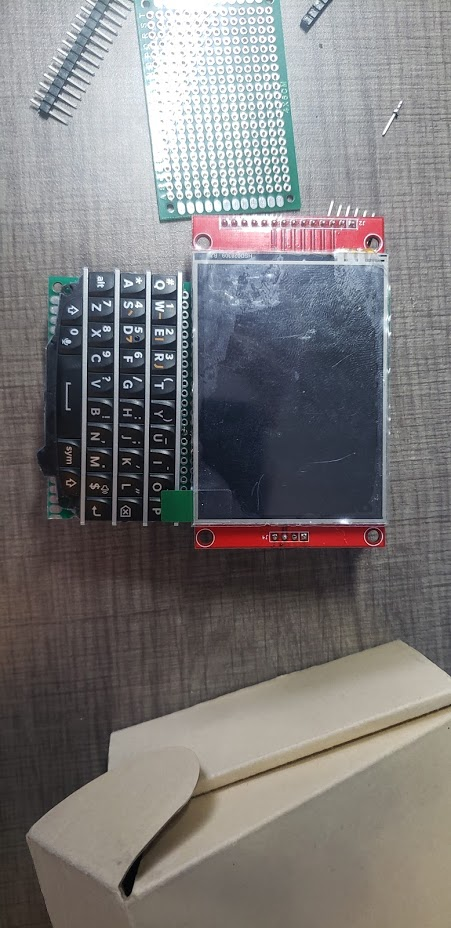

# Lora Phone #

## Description ##

The goal of this project is to build a device that allows you to send text messages in a local public group chat. In a way, this would be a physical version of the [Yik Yak](https://en.wikipedia.org/wiki/Yik_Yak) app which allowed you to view and discuss threads within a 5 mile radius. 
## Functionality ##

- Support for global chat room for everyone within LoRa range
- Username and basic chat support
- Battery powered

## Components ##
- [Heltec Wireless Stick Lite](https://heltec.org/project/wireless-stick-lite/)
    - ESP32 Microcontroller
    - LoRa Radio
    - Battery Management Circuit
- [Blackberry Q10 Keyboard](https://www.ebay.com/itm/BlackBerry-Q10-OEM-Keyboard-With-Flex-Cable-USA/273336623234?epid=1666459990&hash=item3fa421e082:g:U4gAAOSwTfdbO94H)
- [MCP23017 I/O Expander](http://ww1.microchip.com/downloads/en/devicedoc/20001952c.pdf)
- 2000mAh Battery

## ToDo ##

- Design and manufacture a PCB
- 3D Print a casing
- Add multiple chat room support

## Photos ##

### Blackberry Q10 Breakout ###
Design available here: https://github.com/robert-kuramshin/BM14B-eagle

### Breadboard Prototype ###

### Protoboard Prototype ###

### Custom PCB ###
  
Coming soon!
  